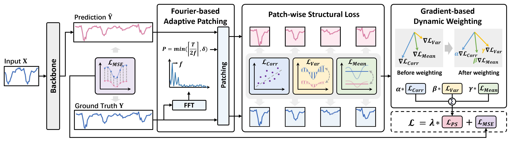

# Patch-wise Structural Loss for Time Series Forecasting


## :sparkles: Abstract

Time-series forecasting has gained significant attention in deep learning due to its crucial role in various domains. 
However, most existing forecasting models rely heavily on point-wise loss functions like Mean Square Error, which treat each time step independently and neglect the structural dependencies inherent in time series data, making it challenging to capture complex temporal patterns accurately.
To address these challenges, we propose a novel **P**atch-wise **S**tructural **PS** loss, designed to enhance structural alignment by comparing time series at the patch level. Through leveraging local statistical properties, such as correlation, variance, and mean, PS loss captures nuanced structural discrepancies overlooked by traditional point-wise losses. Furthermore, it integrates seamlessly with point-wise loss, simultaneously addressing local structural inconsistencies and individual time-step errors.
PS loss establishes a novel benchmark for accurately modeling complex time series data and provides a new perspective on time series loss function design.


## :sparkles: Usage

1. Install Pytorch and necessary dependencies. 
2. The datasets can be obtained from Google Drive (https://drive.google.com/file/d/1l51QsKvQPcqILT3DwfjCgx8Dsg2rpjot/view?pli=1).
```Bash
pip install -r requirements.txt
```
3. Train the model and evaluate. We provide the experiment scripts of all backbones under the folder ./scripts/. You can reproduce the results as the following examples:
```Bash
cd iTransfomer
# Use only MSE loss to train the model
bash ./scripts/ETTh1.sh 1
# Use PS loss to train the model
bash ./scripts/ETTh1.sh 0
```

## :sparkling_heart: Acknowledgements

We appreciate the following GitHub repos a lot for their valuable code and efforts.

- iTransformer: https://github.com/thuml/iTransformer
- PatchTST: https://github.com/yuqinie98/PatchTST
- TimeMixer: https://github.com/kwuking/TimeMixer
- DLinear: https://github.com/cure-lab/LTSF-Linear
- TimesNet: https://github.com/thuml/Time-Series-Library
